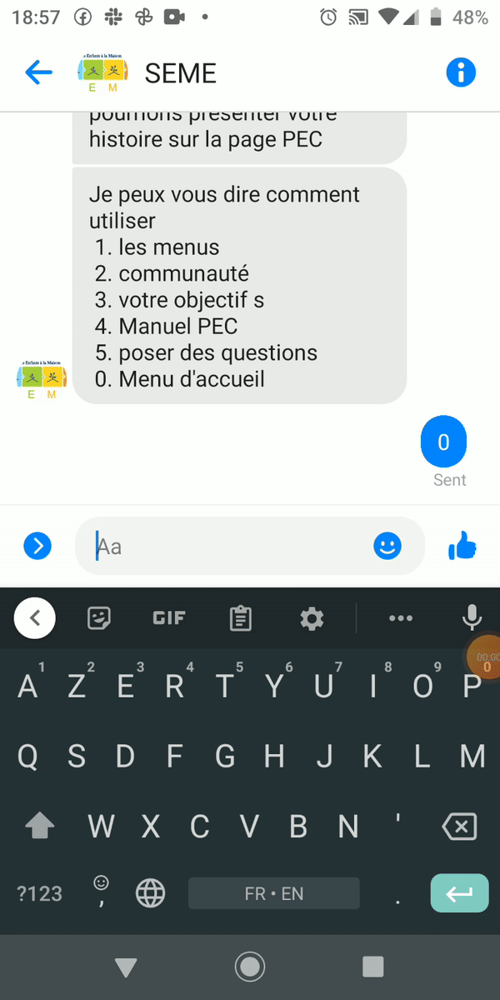

## Welcome to TaRL online Content

Download Manul [French](https://github.com/SEME-CMU/tarl/edit/master/docs/index.md) [Math](https://github.com/SEME-CMU/tarl/edit/master/docs/index.md) 

Here are some tips on using Dia, watch the images and read the text for context

### Sending the message using messenger

The Cayman theme is intended to make it quick and easy for GitHub Pages users to create their first (or 100th) website. The theme should meet the vast majority of users' needs out of the box, erring on the side of simplicity rather than flexibility, and provide users the opportunity to opt-in to additional complexity if they have specific needs or wish to further customize their experience (such as adding custom CSS or modifying the default layout). It should also look great, but that goes without saying.

---

### Browsing through the content

The Cayman theme is intended to make it quick and easy for GitHub Pages users to create their first (or 100th) website. The theme should meet the vast majority of users' needs out of the box, erring on the side of simplicity rather than flexibility, and provide users the opportunity to opt-in to additional complexity if they have specific needs or wish to further customize their experience (such as adding custom CSS or modifying the default layout). It should also look great, but that goes without saying.

---
### Adding a Goal

The Cayman theme is intended to make it quick and easy for GitHub Pages users to create their first (or 100th) website. The theme should meet the vast majority of users' needs out of the box, erring on the side of simplicity rather than flexibility, and provide users the opportunity to opt-in to additional complexity if they have specific needs or wish to further customize their experience (such as adding custom CSS or modifying the default layout). It should also look great, but that goes without saying.
---

### Downloading the PEC manual

The Cayman theme is intended to make it quick and easy for GitHub Pages users to create their first (or 100th) website. The theme should meet the vast majority of users' needs out of the box, erring on the side of simplicity rather than flexibility, and provide users the opportunity to opt-in to additional complexity if they have specific needs or wish to further customize their experience (such as adding custom CSS or modifying the default layout). It should also look great, but that goes without saying.

---

### Community

The Cayman theme is intended to make it quick and easy for GitHub Pages users to create their first (or 100th) website. The theme should meet the vast majority of users' needs out of the box, erring on the side of simplicity rather than flexibility, and provide users the opportunity to opt-in to additional complexity if they have specific needs or wish to further customize their experience (such as adding custom CSS or modifying the default layout). It should also look great, but that goes without saying.

---

### Liking a Facebook Page


The Cayman theme is intended to make it quick and easy for GitHub Pages users to create their first (or 100th) website. The theme should meet the vast majority of users' needs out of the box, erring on the side of simplicity rather than flexibility, and provide users the opportunity to opt-in to additional complexity if they have specific needs or wish to further customize their experience (such as adding custom CSS or modifying the default layout). It should also look great, but that goes without saying.

---


### Finishing the survey

The Cayman theme is intended to make it quick and easy for GitHub Pages users to create their first (or 100th) website. The theme should meet the vast majority of users' needs out of the box, erring on the side of simplicity rather than flexibility, and provide users the opportunity to opt-in to additional complexity if they have specific needs or wish to further customize their experience (such as adding custom CSS or modifying the default layout). It should also look great, but that goes without saying.


### Sharing the profile picture on Facebook

The Cayman theme is intended to make it quick and easy for GitHub Pages users to create their first (or 100th) website. The theme should meet the vast majority of users' needs out of the box, erring on the side of simplicity rather than flexibility, and provide users the opportunity to opt-in to additional complexity if they have specific needs or wish to further customize their experience (such as adding custom CSS or modifying the default layout). It should also look great, but that goes without saying.

Whenever you commit to this repository, GitHub Pages will run [Jekyll](https://jekyllrb.com/) to rebuild the pages in your site, from the content in your Markdown files.

### Markdown

Markdown is a lightweight and easy-to-use syntax for styling your writing. It includes conventions for

```markdown
Syntax highlighted code block

# Header 1
## Header 2
### Header 3

- Bulleted
- List

1. Numbered
2. List

**Bold** and _Italic_ and `Code` text

[Link](url) and 
```

For more details see [GitHub Flavored Markdown](https://guides.github.com/features/mastering-markdown/).

### Support or Contact

Having trouble with Pages? Check out our [documentation](https://docs.github.com/categories/github-pages-basics/) or [contact support](https://github.com/contact) and we’ll help you sort it out.
