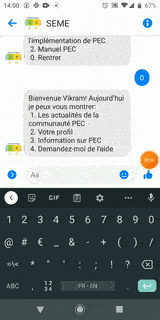

## Bienvenue dans le contenu en ligne de TaRL

Télécharger Manuel [French](french_manual.pdf)  [Math](math_manual.pdf)

Voici quelques conseils sur l'utilisation de Dia, regardez les images et lisez le texte pour le contexte

### Envoi du message via Messenger

  

  
* Ouvrez Facebook Messenger
* Trouvez la page SEME en recherchant "SEME PEC"
* Vous pouvez également cliquer sur le lien https://messenger.com/t/seme.pec
* Envoyez un message de salutation pour commencer :)

---

### Parcourir le contenu

  

* Vous pouvez facilement parcourir le contenu en utilisant les numéros
* Lisez les options et tapez 1-5 pour naviguer dans le menu
* Vous pouvez toujours taper 0 pour accéder à l'écran d'accueil (de n'importe où)

---
### Ajout d'un objectif

  

* Un bon facilitateur fixe des objectifs par semaine et mesure les progrès au quotidien.
* Fixez votre objectif et partagez-le avec vos amis pour rester motivé
* Lorsque vous atteignez le menu de droite, le système vous demandera d'entrer votre objectif
* Vous pouvez taper votre objectif pour la semaine et le système vous aidera à l'atteindre

---

### Téléchargement du manuel PEC

  

* L'option manuelle PEC est pour vous aider à obtenir le dernier manuel PEC.
* Nous avons des manuels français et mathématiques ici.
* Une fois que vous avez réussi à définir, cliquez sur le nom du fichier pour le télécharger dans votre téléphone
* Pour télécharger, allez dans le menu PEC et accédez au manuel (voir image)
* Choisissez le manuel que vous souhaitez télécharger par ex. Français / Math
* Ensuite, vous pouvez télécharger le fichier sur votre téléphone en cliquant sur le lien (voir image)

---

### Communauté

  

* La communauté PEC vous aide à entrer en contact avec les enseignants PEC à travers le pays.
* Vous pouvez lire des histoires ou des blagues d'autres enseignants pour rester motivé.
* Vous pouvez également partager vos histoires avec nous et nous pourrions présenter votre histoire sur la page PEC

---

### Aimer une page Facebook

  

* Veuillez aimer notre page https://www.facebook.com/seme.pec/ pour obtenir les dernières mises à jour
* Vous pouvez également trouver notre page en recherchant "SEME PEC" sur facebook (pensez à chercher l'icône)
* Nous partagerons des histoires intéressantes tout au long de la semaine
* N'hésitez pas à participer à l'incroyable communauté PEC en commentant nos publications

---

<!---
### Partage de la photo de profil sur Facebook
Vos pages

### Fin de l'enquête
Le thème Cayman est destiné à permettre aux utilisateurs de Pages GitHub de créer rapidement et facilement leur premier (ou 100e) site Web. Le thème doit répondre à la grande majorité des besoins des utilisateurs dès la sortie de la boîte, en privilégiant la simplicité plutôt que la flexibilité, et offrir aux utilisateurs la possibilité d'accepter une complexité supplémentaire s'ils ont des besoins spécifiques ou souhaitent personnaliser davantage leur expérience. (comme l'ajout de CSS personnalisé ou la modification de la mise en page par défaut). Il devrait également avoir fière allure, mais cela va sans dire.

-->

### Assistance ou contact

Besoin de plus d'assistance> Appelez Adji: [+22509703988](tel:+22509703988) ou [envoyez-nous un e-mail](mailto:vkamath@andrew.cmu.edu?Subject=[SEME])
