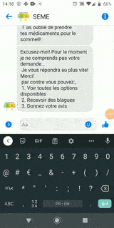
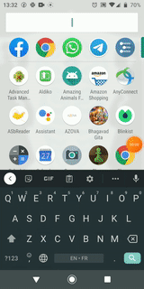

## Welcome to TaRL online Content

Download Manul [French](https://github.com/SEME-CMU/tarl/edit/master/docs/index.md) [Math](https://github.com/SEME-CMU/tarl/edit/master/docs/index.md) 

Here are some tips on using Dia, watch the images and read the text for context

### Sending the message using messenger

  
* Open Facebook Messenger
* Find SEME page by searching for "SEME PEC"
* Alternatively you can click on the link https://messenger.com/t/seme.pec
* Send a salutation message to get started :)

---

### Browsing through the content

* You can easily browse through the content by using the numbers
* Read the options and type 1-5 to navigate the menu
* You can always type 0 to go the home screen (from anywhere)

---
### Adding a Goal

* Un bon facilitateur fixe des objectifs par semaine et mesure les progrès au quotidien. 
* Fixez votre objectif et partagez-le avec vos amis pour rester motivé
* When you reach the right menu, the system will ask you to enter your goal
* You can type your goal for the week and the system will support you achieve it

---

### Downloading the PEC manual

* L'option manuelle PEC est pour vous aider à obtenir le dernier manuel PEC. 
* Nous avons des manuels français et mathématiques ici. 
* Une fois que vous avez trouvé l'élément, cliquez sur le nom du fichier pour le télécharger dans votre téléphone
* To download, go to the PEC menu and navigate to the manual (see image)
* Choose the manual you want to dowload e.g. French/Math
* Then you can download the file to your phone by clicking on the link (see image)

---

### Community

* La communauté PEC vous aide à entrer en contact avec les enseignants PEC à travers le pays. 
* Vous pouvez lire des histoires ou des blagues d'autres enseignants pour rester motivé. 
* Vous pouvez également partager vos histoires avec nous et nous pourrions présenter votre histoire sur la page PEC

---

### Liking a Facebook Page

* Please like our page https://www.facebook.com/seme.pec/ to get the latest updates
* You can also find our page by searching for "SEME PEC" on facebook (remember to look for the icon)
* We will share interesting stories throughut the week 
* Feel free to participate in the amazing PEC community by commenting on our posts

---

<!---
### Sharing the profile picture on Facebook
Your pages 

### Finishing the survey
The Cayman theme is intended to make it quick and easy for GitHub Pages users to create their first (or 100th) website. The theme should meet the vast majority of users' needs out of the box, erring on the side of simplicity rather than flexibility, and provide users the opportunity to opt-in to additional complexity if they have specific needs or wish to further customize their experience (such as adding custom CSS or modifying the default layout). It should also look great, but that goes without saying.

-->

### Support or Contact

Need more support> Call Adji:  [+22509703988](tel:+22509703988) or [email us](mailto:vkamath@andrew.cmu.edu?subject=[SEME])
